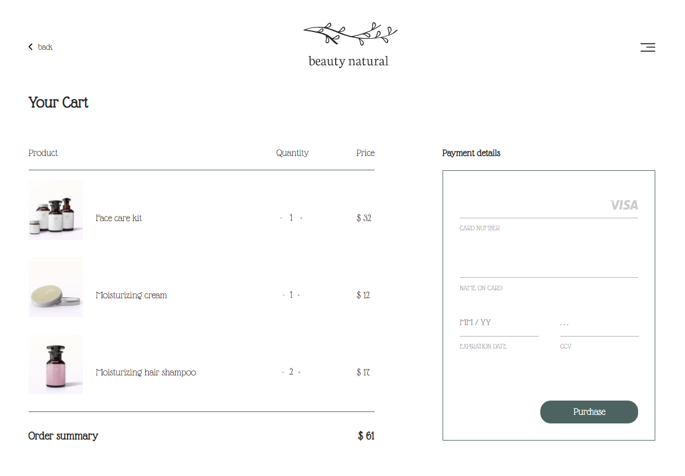
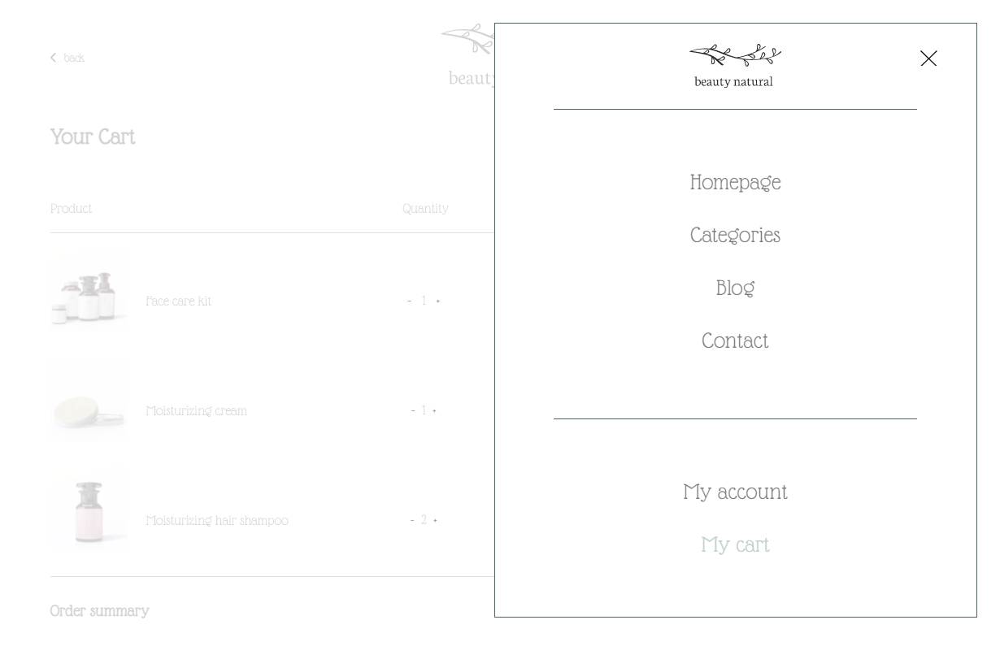
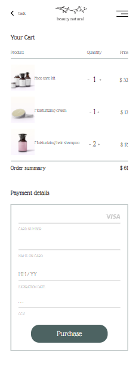
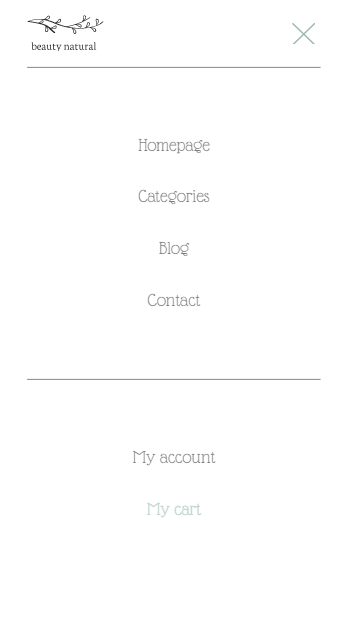

# EXAMPLE OF PRODUCT PAGE

Layout was creating with **HTML**, **CSS** and some **JavaScript**.

I used to **SCSS** to add styles for this webpage.

Product Page is static **without dynamic data** and **form submit**.

Is fully responsive from **375px** to **1600px**.

Page has some effects like for example change color when hover menu, open/close menu and change "Quantity" in first row product (increase or decrease value pressing "**-**" or "**+**" and its't go less than 1).

### PRODUCT PAGE OPEN MENU

#### PRODUCT PAGE MOBILE VIEW 

  

#### PRODUCT PAGE MOBILE MENU

